So this project really started when I saw the Raspberry Pi 4. With additional RAM, this Pi can do more than any of the previous ones. So why not use a couple to establish real-world geometry?

# Figuring Out the Hardware

So I bought 2 RPi's, a few image [sensors](https://www.raspberrypi.org/products/camera-module-v2/), and some [IMU sensors](https://learn.adafruit.com/mpu6050-6-dof-accelerometer-and-gyro). From here, I knew that I needed to network the RPi's together.

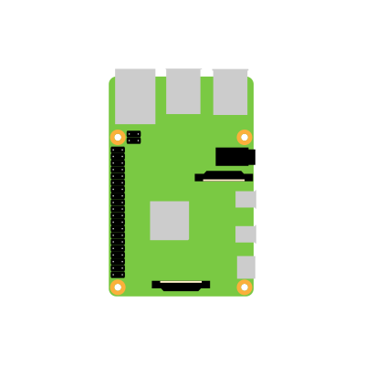

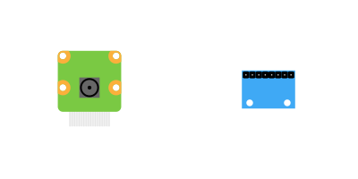

I decided that POE would be the best way to approach not only networking the RPi's together, but POE would supply power too. This TP-Link [switch](https://www.tp-link.com/us/business-networking/unmanaged-switch/tl-sg1005p/) and a POE [hat](https://www.amazon.com/dp/B07XB5PR9J/ref=cm_sw_em_r_mt_dp_5fKDFb03TQA74). Now, the computers are networked together at gigabit speed.

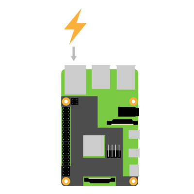

This hat produces a lot of heat. In order to reduce the thermal constraint, 30mm fans were chosen to blow onto the hottest components on the POE hat. The ones I found on [Amazon](https://www.amazon.com/dp/B076H3TKBP/ref=cm_sw_em_r_mt_dp_znRDFb81TWP1T) came in a pack of two.

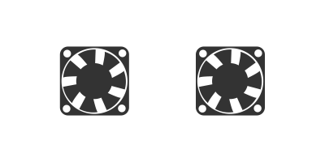

After getting all the hardware, I connected all the components together, and took a test picture.
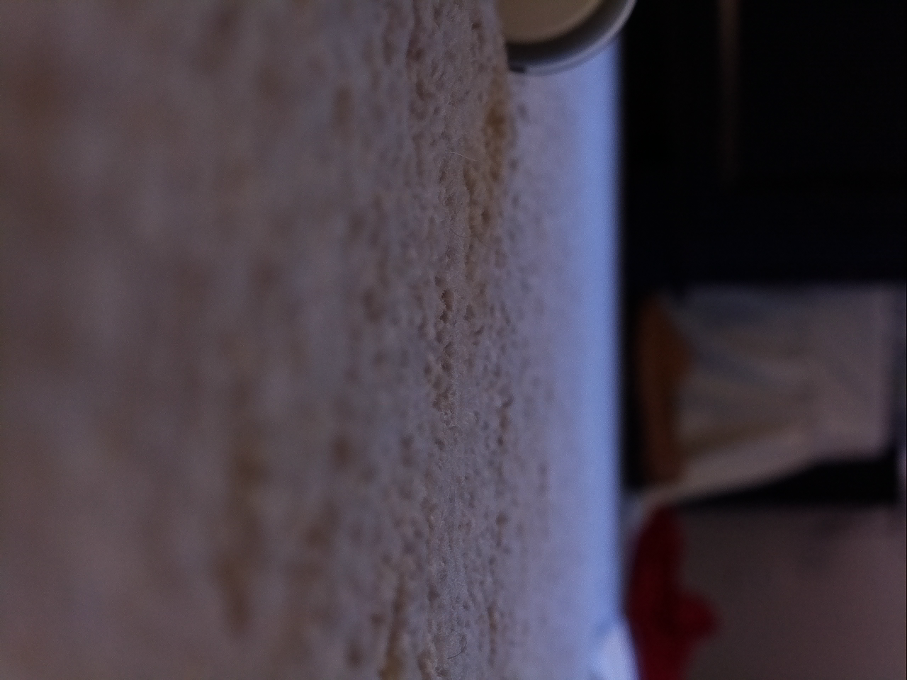

# Assembly 

With all of the hardware decided, I needed to assemble something to hold all of the different components. The cheapest and easiest way to assemble all of the components into a single package would be to "sandwich" the components using sheets of acrylic. With this in mind, I hopped on Illustrator to start designing.

So I started with a couple of the Raspberry Pi's and POE hats next to one another. This will give the positions for the cameras and IMUs.

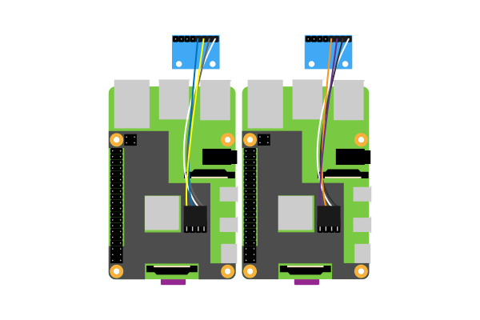

These components would need holes to mount to the acrylic sheet. I then developed an acrylic sheet with holes for the components, handles and a passthrough for the ethernet.

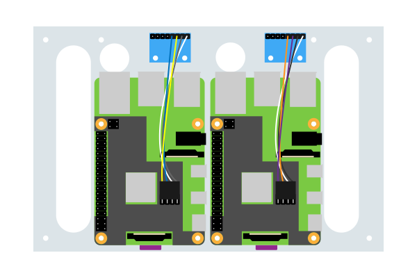

I then needed to do the same thing to hold the cameras and cooling fans. I matched the previous holes for support.

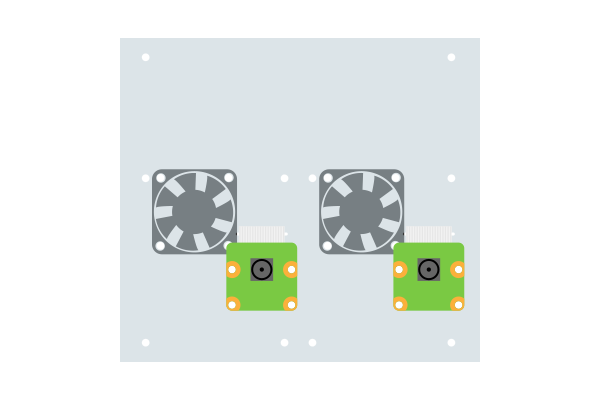

I decided to add some I/O to this project: LEDs and push buttons. The Raspberry Pi has great GPIO (general-purpose input/output) pins that allow for many different configurations. I ended up using the pins 7, 11, and 13. The following schematic describes the wiring required.

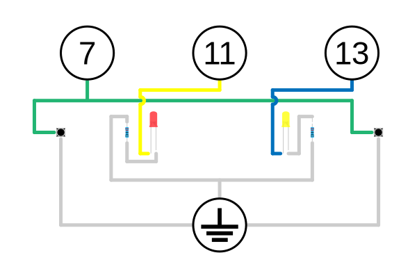

The only components left to mount are the network switch, the push buttons, and the LEDs. The back-facing acrylic sheet is designed to hold these and add support to the handles.

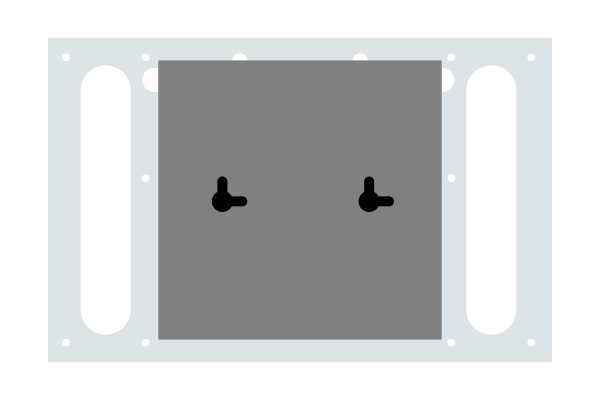

With all of these designed, I printed each layer and glued them to acrylic sheets. Using the dremel tool and a little help from my dad, I cut the holes and handles. The sheets were then assembled together using 2.5mm stand-offs.

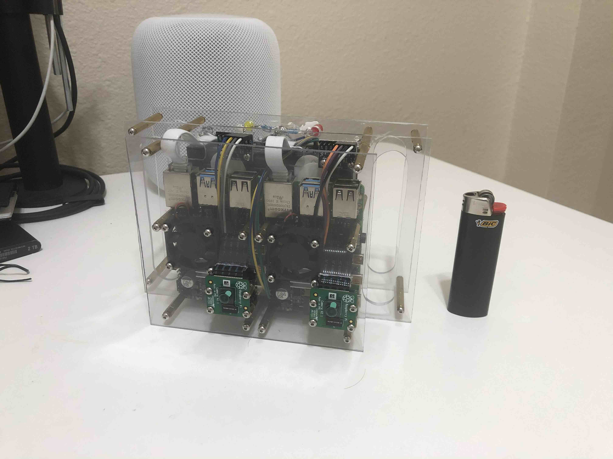