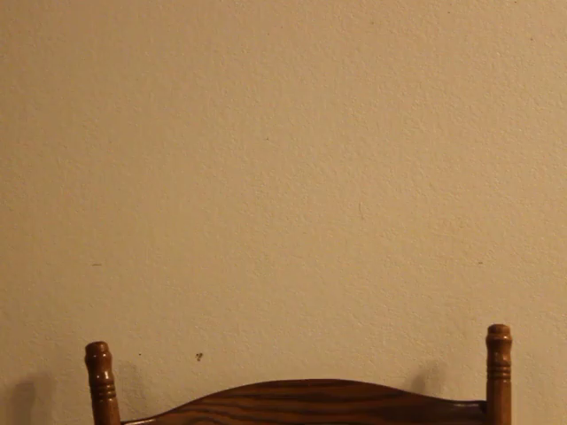
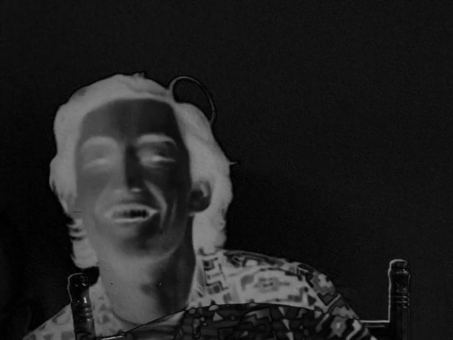
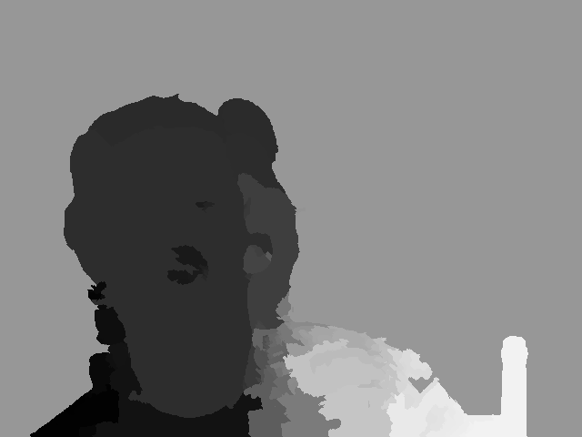
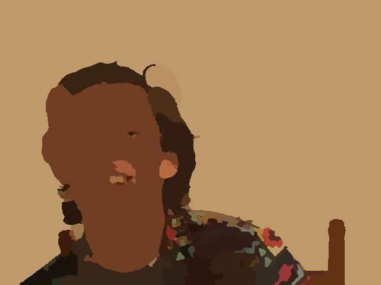
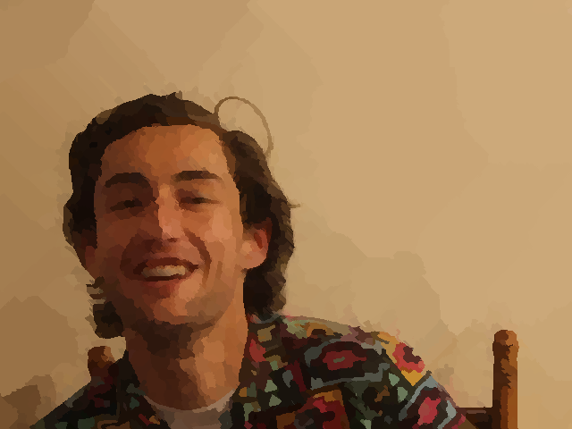
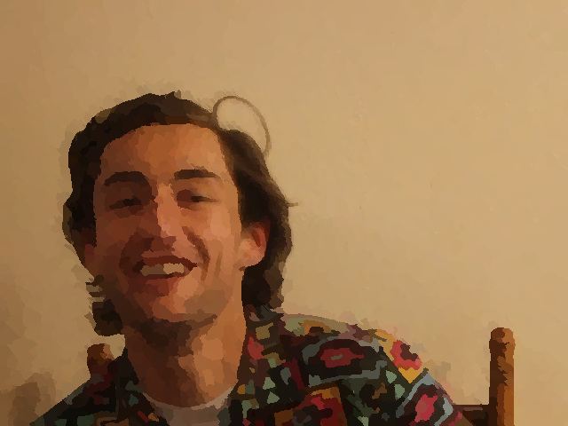

The [initial algorithm](https://github.com/tnorlund/BestFeatureRotoscope) was written in MATLAB. This allowed us to dynamically allocated memory and prototype quickly.

The algorithm works in 4 basic steps
1. Background Subtraction
2. Shi-Tomasi Feature Extraction
3. Watershed Segmentation
4. Color Palette Selection

# Background Subtraction

The first step in the algorithm is separating the person from the background. In order to do this, we subtracted the speaker from the background. This subtraction is inverted to produce a matte which determines which portion of the image is the background and which is the foreground.

**Background**

**Foreground**

**Matte**

# Shi-Tomasi Feature Extraction

After determining where the speaker is within the frame, the individual features of the speaker were identified. We decided to use Shi-Tomasi, a feature detection algorithm that uses the Eigenvalues of the gradient.

The first step in this was to calculate the gradient horizontally and vertically, $I_{x}$ and $I_{y}$ respectively.

$$
\begin{bmatrix}I_{x} & I_{y}\end{bmatrix}
\begin{bmatrix}\Delta\,u \\ \Delta\,v\end{bmatrix} =
-\frac{\partial I}{\partial t} = -I_{t}
$$

The change in intensity, $Z$, is solved by using the constraint of the optical flow equation, $e$.
$$
Z \begin{bmatrix}\Delta\,u \\ \Delta\,v\end{bmatrix} = -e
$$

To solve for $Z$, each pixel of the horizontal and vertical gradients, $I_{x}$ and $I_{y}$, within the feature’s window is either squared or multiplied.
$$
Z = \sum_{x \in \mathcal{R}} \begin{bmatrix} I^{2}_{x}(x) & I_{x}(x)I_{y}(x) \\ I_{x}(x)I_{y}(x) & I^{2}_{y}(x) \end{bmatrix}
$$

The solution to the optical flow constraint is found by taking its limit.
$$
\begin{aligned}
-I_{t} = -\frac{\partial I}{\partial t} \approx \lim_{\Delta t \to\infty} &\frac{x(t + \Delta\,t) - x(t)}{\Delta\,t}\frac{\partial I}{\partial x} \\&+ \frac{y(t + \Delta\,t) - y(t)}{\Delta\,t}\frac{\partial I}{\partial y}
\end{aligned}
$$
$$
-\frac{\partial I}{\partial t} \approx \frac{dx}{dt} \frac{\partial I}{\partial x} + \frac{dy}{dt} \frac{\partial I}{\partial y}
$$

The optical flow equation, $e$, is solved by scaling the horizontal and vertical gradients, $I_{x}$ and $I_{y}$, with the approximation, $I_{t}$, at each pixel location, $x$.
$$
e = \sum_{x \in \mathcal{R}} \begin{bmatrix}I_{x}(x)I_{t}(x)\\I_{y}(x)I_{t}(x)\end{bmatrix}
$$

Finally, the constraint can be used to solve for $\Delta\,u$ and $\Delta\,v$.
$$
\begin{aligned}
\Delta\,u =& \frac{I_{y}^{2} \cdot I_{x}I_{t} - I_{x}I_{y} \cdot I_{y}I_{t}}{\text{det}\,Z} \\
\Delta\,v =& \frac{I_{x}^{2} \cdot I_{y}I_{t} - I_{x}I_{y} \cdot I_{x}I_{t}}{\text{det}\,Z}
\end{aligned}
$$

Once this process has been repeated for all of the pixels in the frame, the largest Eigenvalues of $Z$ are used as features.

# Watershed Segmentation

After finding the features of the speaker, the features are used as *catchment basins* for watershed segmentation. This is similar to how water rises in a pool. If each feature is where the water is coming from, the segment would be the area of the pool. This process changes the interesting features into interesting segments.

# Color Palette Selection

The last step is to determine the color for the interesting segment. The average color found in the foreground image is calculated and flood filled throughout the segment. This version showed us that the number of features calculated earlier produces different results. 

**125 Features**

**1250 Features**

**2500 Features**

The biggest problem with this implementation is that it is really slow. Creating the 1250 feature example on my Late 2013 MacBook Pro took over 16 seconds. MATLAB is not only weakly typed, but it is obviously not the best way to implement this algorithm.
