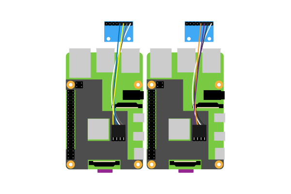
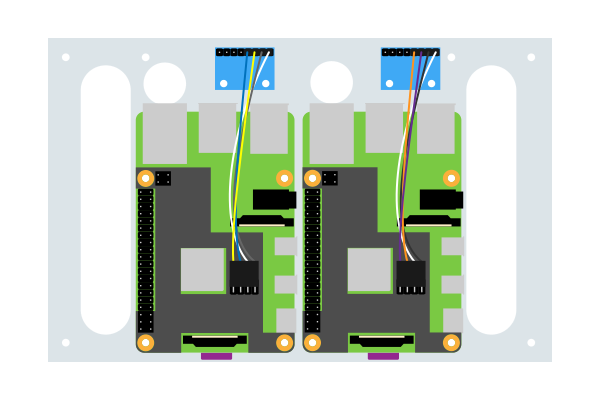
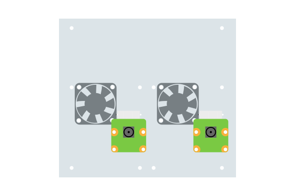
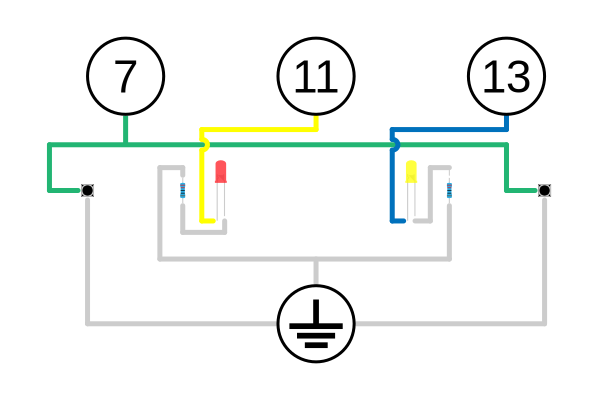
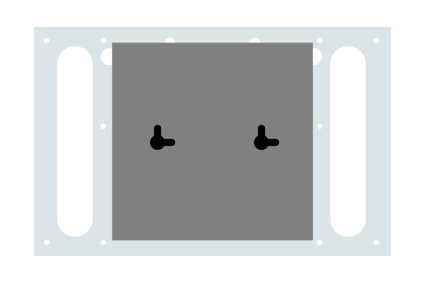
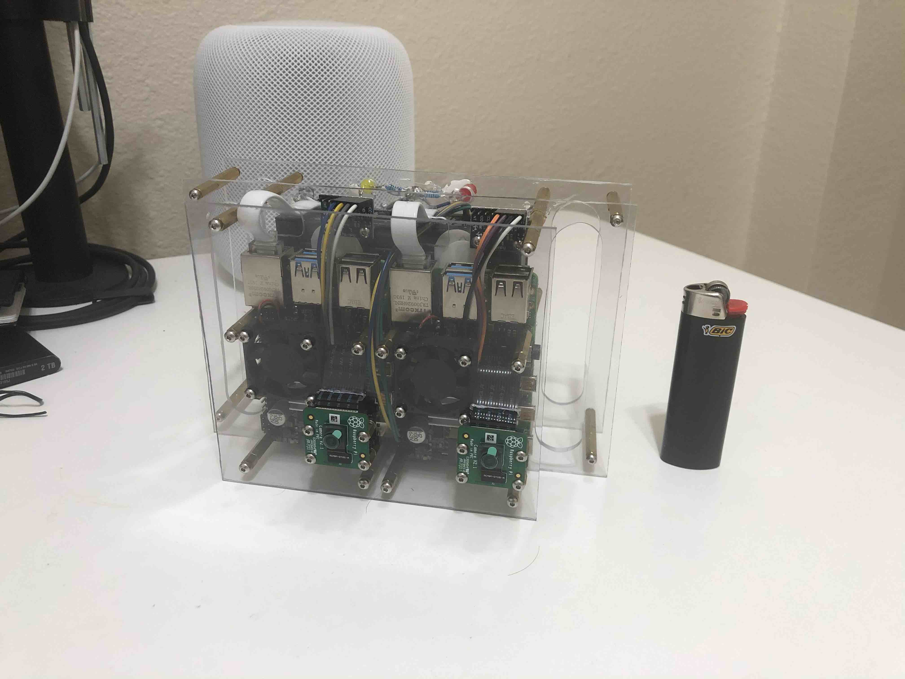

With all of the hardware decided, I needed to assemble something to hold all of the different componenets. The cheapest and easiest way to assemble all of the components into a single package would be to "sandwich" the components using sheets of acrylic. With this in mind, I hopped on Illustrator to start designing.

So I started with a couple of the Raspberry Pi's and POE hats next to one another. This will give the positions for the cameras and IMU's.

These componenets would need holes to mount to the acrylic sheet. I then developed an acrylic sheet with holes for the componenets, handles and a passthrough for the ethernet.

I then needed to do the same thing to hold the cameras and cooling fans. I matched the previous holes for support.

I decided to add some I/O to this project: LEDs and push buttons. The Raspberry Pi has great GPIO (general-purpose input/output) pins that allow for many different configurations. I ended up using the pins 7, 11, and 13. The following schematic describes the wiring required.

The only components left to mount are the network switch, the push buttons, and the LEDs. The back-facing acrylic sheet is designed to hold these and add support to the handles.

With all of these designed, I printed each layer and glued them to acrylic sheets. Using the dremel tool and a little help from my dad, I cut the holes and handles. The sheets were then assembled together using 2.5mm stand-offs.

