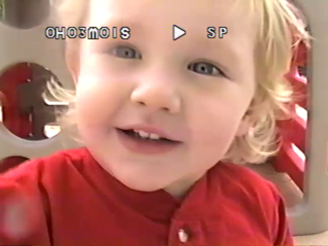

import capture from './capture.png'

Going into this, I had no idea where to start. My dad recommended 
[Legacy Box](https://legacybox.com), but after realizing my 50+ tapes would end 
up costing $1,000, I decided to continue looking.

While Walmart and Costco offer similar services, I decided that I could do this
on my own. I hopped on eBay and bought a Toshiba VHS player and a VHS-C
converter. With this, I only needed a way to get the analogue video and audio
to the computer.

I started with a USB capture card called [EasyCap](https://www.amazon.com/gp/product/B01H6OQI1W/ref=ppx_yo_dt_b_asin_title_o04_s00?ie=UTF8&psc=1).

This capture card came with some red flags:
- software and drivers *only* for Windows 
- it didn't look like the pictures on Amazon
- no customer support

No matter how many different tapes and computers I tried, the recordings didn't match the PAL frame-rate and resulted in corrupted audio. I returned it the next day.

I had to approach this with a product that is well used by the public. With my history playing video games, I knew of [Elgato](https://www.elgato.com/en).

Elgato has a "video capture" capture card that is still used by the public, and their software supports MacOS and Windows. I bought the Elgato capture card at $90.

I've currently recorded half the videos and will share the results after recording all of them.

